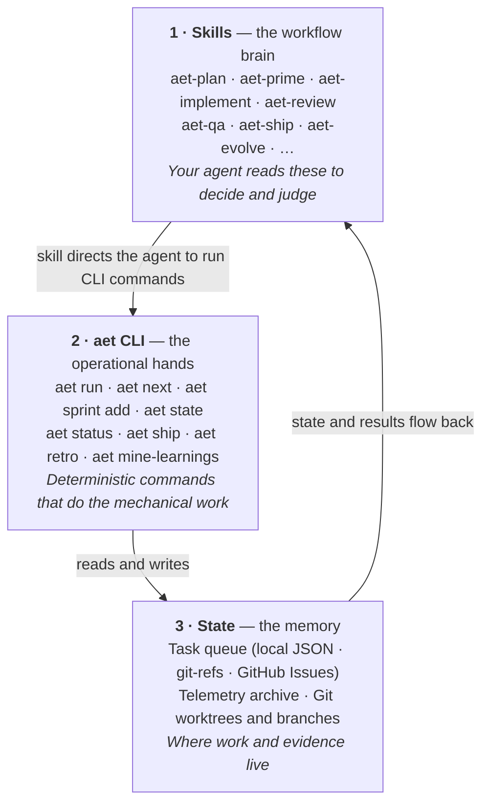

# Agentic Engineering Toolkit (AE Toolkit)

**AE Toolkit is a process, not a collection of prompts.**

Most AI coding sessions start strong and end in drift. The agent builds what it _assumed_, not what you _meant_. Context degrades after a few tasks. The same bug shows up next week because the system never learned. There is no workflow — just vibes and hope.

AE Toolkit fixes this by encoding the best agentic engineering patterns from YC, Garry Tan (GStack), Matt Pocock, and the AI Transformation Workshop into a modular skill suite. Every request is classified by **work class** (trivial / normal / critical) before any skill runs, so a typo fix doesn't endure full PRD ceremony and an auth rewrite doesn't slip through with mocked tests alone:

**Triage → Plan → Design → Validate → Prime → Implement → QA → Review → Ship → Evolve**

`/aet-prime` classifies the request and routes it to the appropriate pipeline. Trivial tasks ship in minutes. Normal tasks get lightweight plans. Critical tasks (auth, data, infrastructure, upgrades) run the full sequence including `/aet-verify` — observed evidence that the system actually works before merge. `/aet-plan` writes a PRD. `/aet-design-system-creation` produces DESIGN.md — your design source of truth. `/aet-validate-scope` checks the plan and design against your existing domain model and documented decisions before a single line of code is written. `/aet-implement` reads the plan — with `/aet-tdd` optionally guiding test-first development. `/aet-review` catches what `/aet-implement` missed. `/aet-qa` verifies the fix. `/aet-ship` gates the merge. `/aet-evolve` updates the rules so the bug never repeats. Nothing falls through the cracks because every step knows what came before it.

## What you get

- **Proportionate ceremony** — `aet-prime` classifies every request into trivial, normal, or critical work. A typo ships in minutes; auth changes run the full pipeline
- **Shared understanding before code** — `clarify-goal` builds shared understanding through targeted questions until the agent actually gets it
- **Validate against reality before you build** — `aet-validate-scope` catches terminology conflicts, code contradictions, and architectural misalignment while they're still cheap to fix
- **Observed evidence for critical work** — `aet-verify` exercises the running system and captures proof (HTTP response, screenshot, CLI output) before merge
- **Test-first development** — `aet-tdd` guides red-green-refactor with vertical tracer bullets and integration-style tests that survive refactors
- **Fresh-session implementation** — plans and code never share a context window; bias can't leak
- **Night-shift productivity** — `aet run` grinds through your curated task queue while you sleep, clearing context between each ticket so quality doesn't degrade. Tasks only close with evidence, and runs shut down cleanly on timeout
- **A local dashboard for your work** — the telemetry panel lets you browse plans, watch pipeline progress, and review run history without digging through files
- **One-command full flows** — `aet-pipeline-plan` runs the entire planning sequence; `aet run` runs the full implementation sequence with session-isolated stages
- **Dependency upgrades as first-class work** — `aet-upgrade` analyzes breaking changes, maps risk, and validates before you bump a framework version
- **Compounding quality** — every bug updates a rule, template, or guardrail in `.agents/`. The system gets smarter across sessions, not just within them.
- **Agent-agnostic** — works with Claude Code, Kimi, Cursor, Codex, Copilot, or paste-into-chat. Your workflow is portable.

### Who it's for

- **Solo developers** who want agentic workflows without building them from scratch
- **Engineering leads** who want consistent planning, review, and shipping standards across a team
- **AI-native startups** who treat the AI layer (rules, commands, skills) as first-class infrastructure

---

## How the pieces fit together

AE Toolkit has three layers. **Skills decide, the `aet` CLI does, and state remembers.** Your agent reads the skills to make judgment calls; the skills direct the agent to run `aet` CLI commands for anything mechanical; the CLI is the single writer for the queue, telemetry, and git state.



| Layer                | Responsible for                                                                                 | You invoke it by                                  |
| -------------------- | ----------------------------------------------------------------------------------------------- | ------------------------------------------------- |
| **Skills** (`aet-*`) | Judgment and workflow — triage, planning, review, QA, quality gates                             | Your agent: `/aet-plan` or natural language       |
| **`aet` CLI**        | Deterministic operations — queue management, orchestration, state transitions, telemetry mining | Your terminal: `aet run`, `aet state`, `aet ship` |
| **State**            | Persistence — the task queue, telemetry archive, git worktrees                                  | Indirectly, through the CLI                       |

This is why `aet plan` doesn't exist: planning is judgment — a skill your agent runs — not an operation. The CLI only owns mechanical, repeatable work, and because it's the single writer for queue and state transitions, unattended runs can't corrupt state.

---

## Quick Start

AE Toolkit has two parts: the **Python CLI package** (`aet`) and the **skill instructions** your agent reads. You need both for the pipeline to work.

### One-line install (macOS/Linux)

The installer bootstraps `uv`, clones the repo, installs the `aet` CLI into a dedicated venv, links skills into detected agent directories, and symlinks `aet` onto `PATH`:

```bash
curl -fsSL https://raw.githubusercontent.com/thebrightnest/ae-toolkit/main/scripts/install.sh | bash
```

Target a specific agent, preview changes, or pin a release:

```bash
# Target one agent directory explicitly
curl -fsSL https://raw.githubusercontent.com/thebrightnest/ae-toolkit/main/scripts/install.sh | bash -s -- --agent claude-code

# Preview every planned action without making changes
curl -fsSL https://raw.githubusercontent.com/thebrightnest/ae-toolkit/main/scripts/install.sh | bash -s -- --dry-run

# Install a specific tag
curl -fsSL https://raw.githubusercontent.com/thebrightnest/ae-toolkit/main/scripts/install.sh | bash -s -- --tag v1.3.0
```

#### Installer options

| Flag                 | Description                                                                   | Example                         |
| -------------------- | ----------------------------------------------------------------------------- | ------------------------------- |
| `--tag <tag>`        | Install a tagged release (default: latest semver tag, falling back to `main`) | `--tag v1.3.0`                  |
| `--agent <agent>`    | Target one agent directory: `claude-code`, `kimi`, `cursor`, or `generic`     | `--agent claude-code`           |
| `--bin-dir <dir>`    | Target `PATH` directory for the `aet` symlink (default: `~/.local/bin`)       | `--bin-dir ~/.bin`              |
| `--skills-dir <dir>` | Override the skills directory (default: auto-detect)                          | `--skills-dir ~/.claude/skills` |
| `--repo <url\|path>` | Clone from a different source (default: GitHub main repo)                     | `--repo /path/to/local/clone`   |
| `--dry-run`          | Print planned actions without making changes                                  | `--dry-run`                     |

#### Troubleshooting

**`aet` command not found after install.** The installer symlinks `aet` into `~/.local/bin` (or the directory you passed to `--bin-dir`). If that directory is not on your `PATH`, add it to your shell profile:

```bash
# bash/zsh
echo 'export PATH="$HOME/.local/bin:$PATH"' >> ~/.bashrc  # or ~/.zshrc
```

Then reload your profile (`source ~/.bashrc` or `source ~/.zshrc`) or open a new shell.

### Manual install

If you prefer not to run the curl installer, install the Python package and skills separately:

#### 1. Install the Python package

```bash
# Latest release from source
pip install git+https://github.com/thebrightnest/ae-toolkit.git@v1.3.0
```

#### 2. Install the skills

```bash
# Auto-detect installed agents and link skills to all of them
aet setup skills

# Target a specific agent directory
aet setup skills --agent claude-code

# Use a custom skills directory
aet setup skills --skills-dir ~/.claude/skills

# Preview what would happen without making changes
aet setup skills --dry-run
```

Or install skills via `npx`:

```bash
npx skills add https://github.com/thebrightnest/ae-toolkit --all
```

#### 3. Put `aet` on `PATH`

```bash
aet setup link
```

The command symlinks `aet` into `~/.local/bin` (override with `AET_BIN_DIR`). If `~/.local/bin` is not on your `PATH`, add it to your shell profile. The link is no longer self-healing; re-run the installer or `aet setup link` if it breaks.

You can also copy skill directories to your agent's skills folder, or paste the skill content directly into chat:

```bash
# Agent-neutral standard
cp -r skills/aet-setup ~/.agents/skills/

# Or simply open any SKILL.md and paste it into your chat
```

### Development install

Clone the repo and install editable for local development:

```bash
git clone https://github.com/thebrightnest/ae-toolkit.git
cd ae-toolkit
pip install -e ".[dev]"
make install-skills
```

`make install-skills` installs the package, symlinks skills, and runs `aet setup link` automatically.

### Run it

| Tool                          | How to invoke             | Example                               |
| ----------------------------- | ------------------------- | ------------------------------------- |
| **Claude Code**               | Slash command             | `/aet-setup`                          |
| **Kimi Code CLI**             | Natural language          | "Run aet-setup on this project"       |
| **Cursor**                    | Natural language or rules | "Set up this project with aet-setup"  |
| **Codex / Copilot / Generic** | Paste into prompt         | Copy `SKILL.md` content into the chat |

Pipelines work the same way — just invoke `aet-pipeline-plan` for planning or `aet run` for implementation with session-isolated stages.

All skills follow the same markdown-based format. The agent reads the YAML frontmatter (`name`, `description`) to decide when to trigger, then loads the full instructions on demand.

---

## Skills

These are the components of the AE Toolkit system. They are installed together; the pipeline only works when all of them are present.

| Skill                                                             | Description                                                                                                                                                                               |
| ----------------------------------------------------------------- | ----------------------------------------------------------------------------------------------------------------------------------------------------------------------------------------- |
| [aet-setup](./skills/aet-setup)                                   | Bootstrap or upgrade any software project with best-practice documentation, code quality enforcement, local automation, and AI guardrails. Scaffolds the agentic workflow infrastructure. |
| [aet-extract-stack](./skills/aet-extract-stack)                   | Extract proven infrastructure, DevOps, and automation setup from an existing project into a reusable, sanitized scaffold. Inverse of aet-setup.                                           |
| [aet-plan](./skills/aet-plan)                                     | PRD creation, goal clarification, story breakdown, plan.md generation, and optional issue tracker publishing. Prevents misalignment before any code is written.                           |
| [aet-design-system-creation](./skills/aet-design-system-creation) | Complete design system creation: aesthetic direction, typography, color, layout, motion. Produces DESIGN.md as the project's design source of truth. Opinionated and research-driven.     |
| [aet-validate-scope](./skills/aet-validate-scope)                 | Validate a plan against the existing domain model, terminology, and documented decisions. Includes UI/UX coverage lens. Post-PRD alignment gate before implementation.                    |
| [aet-evolve](./skills/aet-evolve)                                 | System evolution through retrospectives and rule/command/template updates. Cross-project learning propagation and escalation ladder. The highest-leverage long-term skill.                |
| [aet-prime](./skills/aet-prime)                                   | Session context loading with git-as-memory and context discipline. **Triage front door** — classifies requests into work class and routes to proportionate pipeline.                      |
| [aet-verify](./skills/aet-verify)                                 | Conditional live verification with three modes: foundation smoke, feature evidence capture, and bug reproduction. Required gate for critical work before merge.                           |
| [aet-upgrade](./skills/aet-upgrade)                               | Dependency and framework upgrades as a first-class work type. Breaking-change analysis, risk mapping, and smoke validation.                                                               |
| [aet-tdd](./skills/aet-tdd)                                       | Test-driven development with red-green-refactor loop and vertical tracer bullets. Integration-style tests through public interfaces.                                                      |
| [aet-implement](./skills/aet-implement)                           | Fresh-session implementation from plan.md with self-validation.                                                                                                                           |
| [aet-review](./skills/aet-review)                                 | Staff-level code review with multi-lens checks and cross-model adversarial challenge.                                                                                                     |
| [aet-cso](./skills/aet-cso)                                       | Diff-focused security audit: secrets, injection risks, auth bypass, CVEs, LLM trust boundaries.                                                                                           |
| [aet-qa](./skills/aet-qa)                                         | Automated QA with tiered validation (Quick/Standard/Exhaustive) and regression test generation.                                                                                           |
| [aet-bug-report](./skills/aet-bug-report)                         | Structured bug investigation and fixing. Reproduce, diagnose, fix, and validate without the overhead of full PRD planning.                                                                |
| [aet-ship](./skills/aet-ship)                                     | Pre-merge validation gate with bisectable commits, commit-message conventions, and PR creation.                                                                                           |
| [aet-release-prep](./skills/aet-release-prep)                     | Release preparation: analyze commits, suggest version bumps, and update CHANGELOG.md and PRODUCT.md.                                                                                      |
| [aet-sync-docs](./skills/aet-sync-docs)                           | Sync PRD and plan.md to reflect what was actually built. Appends a divergence summary when implementation drifts from the plan.                                                           |
| [aet-work](./skills/aet-work)                                     | Work queue management and AFK task orchestration. Curated intake, evidence-gated completion, and a local telemetry panel. Backed by local JSON, git-refs, or GitHub Issues.               |

### Pipelines

These skills orchestrate the full toolkit workflow:

| Skill                                           | Description                                                                                               |
| ----------------------------------------------- | --------------------------------------------------------------------------------------------------------- |
| [aet-pipeline-plan](./skills/aet-pipeline-plan) | End-to-end planning pipeline. Runs triage → plan → validate-scope with hard human gates.                  |
| [aet-work](./skills/aet-work)                   | Work queue management with unified orchestrator. Runs plans with session-isolated, evidence-gated stages. |

---

## Use Cases

Eight real-world scenarios show how the skills compose into complete workflows:

- [Starting a new project](./docs/use-cases.md#scenario-1-starting-a-new-project)
- [Adopting on an existing project](./docs/use-cases.md#scenario-2-adopting-on-an-existing-project)
- [Single task / PIV loop](./docs/use-cases.md#scenario-3-single-task--piv-loop)
- [Big feature / Epic with multiple tasks (AFK loop)](./docs/use-cases.md#scenario-4-big-feature--epic-with-multiple-tasks-afk-loop)
- [System evolution after a bug](./docs/use-cases.md#scenario-5-system-evolution-after-a-bug)
- [Security-first PR](./docs/use-cases.md#scenario-6-security-first-pr)
- [Refactoring with TDD safety rails](./docs/use-cases.md#scenario-7-refactoring-with-tdd-safety-rails)
- [Validating a plan against existing architecture](./docs/use-cases.md#scenario-8-validating-a-plan-against-existing-architecture)

Read the full walkthroughs in [docs/use-cases.md](./docs/use-cases.md).

---

## Development Workflow

This repo is the source of truth. All skills are symlinked from here to your agent's skills directory for active development.

```bash
# Install all skills from this repo into ~/.agents/skills/
make install-skills

# Or use the CLI equivalent
aet setup skills

# Install into a different skills directory
SKILLS_DIR=~/.claude/skills make install-skills
SKILLS_DIR=~/.cursor/skills make install-skills

# Target a specific agent directory from the CLI
aet setup skills --agent claude-code

# Scaffold a new skill
make add-skill NAME=my-new-skill
```

## Adding a New Skill

```bash
make add-skill NAME=my-skill
```

This creates:

```
skills/my-skill/
├── SKILL.md
├── examples/
│   └── README.md
└── references/
    └── README.md
```

Edit `SKILL.md` following the [skill creator guide](https://docs.kimi.ai/skills). Key rules:

- YAML frontmatter with `name` and `description` (description is the trigger — be explicit about when to use it)
- Concise is key — only add context the AI doesn't already have
- Use references/ for detailed docs, keep SKILL.md for procedural instructions

## Upgrades

See [docs/upgrades/README.md](./docs/upgrades/README.md) for version-specific upgrade guides.

## License

MIT
