# AET Plan-Task Lifecycle

This diagram explains where a plan lives at each stage of the AET workflow, why the design splits the plan between files and the task record, and what benefit each split provides.

## The lifecycle

### 1. Authoring — `docs/plans/<id>.md`

A human or agent writes the plan as a normal markdown file with YAML frontmatter.

**What is here:** the full plan text — title, body, task list, size, blockers, pipeline routing, and any required evidence declarations.

**Why a file:** humans and agents think in documents. Editing a plan requires a familiar markdown surface, diff tooling, and the ability to iterate before the plan is accepted into the queue.

---

### 2. Intake — `aet sprint add`

When the plan is accepted into the sprint, AET creates a **task record** from the file.

**What happens:**

- `new_task_from_plan()` reads the plan file.
- `extract_plan_spec()` copies the routing frontmatter, title, body, and task list into a portable `spec` dict.
- A task dict is created with fields such as `id`, `title`, `state`, `blocked_by`, `pending_blockers`, `history`, and `spec`.

**Result:** the plan content now lives inside the task record.

---

### 3. Live queue — `refs/aet/tasks/<id>`

With the git-refs backend (the default from v1.9.0), the task record is stored as a JSON blob addressed by a git ref.

**What is here:** the authoritative task state, including the embedded plan spec.

**What happens to the original file:** `docs/plans/<id>.md` becomes a gitignored working copy. It is no longer the source of truth, but it remains editable for quick reference or small updates before a run.

---

### 4. Run start — `aet run-one`

When the orchestrator starts a task, it creates an isolated git worktree and renders the plan back into a file.

**What happens:**

- `render_task_plan()` writes `docs/plans/<id>.md` inside the worktree from the task record's `spec`.
- If the record has no spec (legacy task), it falls back to copying the original plan file.

**Result:** the agent sees a normal plan file in the worktree, even though the durable source is the task record.

---

### 5. Implementation

The agent edits code and may update the plan file in the worktree. The implementation commits are made in the task branch.

**Important:** edits to the worktree plan file are local to that run. They are not automatically copied back into the task record. If the plan needs to change durably, it should be edited in the main checkout and the task record re-seeded (or the change should be captured in the implementation commits and PR description).

---

### 6. Terminal closure — `aet ship close`

When the task is merged, AET seals the task.

**What happens:**

- The task ref `refs/aet/tasks/<id>` is deleted.
- The full task record, including its history and final state, is appended to `.agents/work-history.jsonl`.
- The plan file is moved to `docs/plans/archive/<id>.md`.

**Result:** the task leaves the live queue but remains inspectable in the archive and history.

---

## Why this design?

| Decision | Reasoning | Benefit |
| -------- | --------- | ------- |
| **Plan content is embedded in the task record** | A task must be runnable on a clone that does not have the original plan file. | Multi-machine handoffs work without committing live plans to `main`. |
| **Live plans are gitignored** | Plans change during implementation. Committing every draft would pollute `main` and create merge conflicts. | `main` contains only settled, archived plans; PR diffs stay focused on implementation. |
| **Task records live in git refs** |Refs travel with the repository, are atomic, and do not collide with normal files. | Queue state is durable, shared, and does not leak local `~/.aet` files across machines. |
| **Plan is re-rendered in the worktree** | Agents still need a markdown file to read and reference while working. | The implementation experience is unchanged — the agent sees a normal `docs/plans/<id>.md` file. |
| **Settled plans are archived** | Once a task is done, its plan becomes historical documentation. | The archive preserves the plan as it was at closure without cluttering the live plan directory. |

## Common points of confusion

- **"Is the plan in a file or not?"** — Both. It is a file while being authored and while being executed. Between those two moments, the authoritative copy is the `spec` inside the task record.
- **"What is the source of truth?"** — The task record is the source of truth for routing and execution. The plan file is the authoring and execution surface.
- **"Why not just commit the plan file?"** — That was the pre-v1.7.0 model. It caused live plan drafts to appear in `main`, created noise in PR diffs, and made multi-machine sync depend on committed files rather than queue state.
